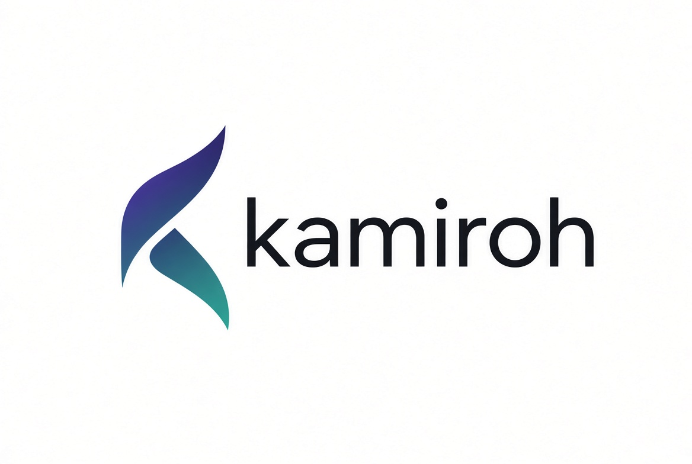

  

# kamiroh

Kameo actors for agents over Iroh

Peer actors, addressable by name and endpoint, that message each other—-locally or across the network—-to drive agents.

*kamiroh — “Let’s be awesome!”*

> **Status: early / WIP** — API and behavior may change.

## What it aims to be

kamiroh is meant to be a peer-oriented control layer for long-running agents. The aim is to combine:

1. **Attach and drive** — take hold of long-running agents already running on a home-office node under Herdr, and drive them locally or from a client. **kamiroh does not start agents, and cannot stop one** — see [Non-goals](#non-goals); Herdr owns that, deliberately.
2. **Actor API** — Kameo-style actors as the control surface: prompt it, ask what it is doing, wait until it finishes or needs a human, give up waiting, or detach from it
3. **Reachability** — Iroh connections accepted only from **allowlisted** endpoints (for example home ↔ cafe, behind NAT)
4. **Agent-agnostic control** — no assumption about what each agent does; coding, testing, delegated app control, or anything else stays outside kamiroh
5. **Peers** — agent control is peer-to-peer (no central control gateway). Iroh relays may still assist with NAT traversal; they do not command agents.

**Control model:** each agent is driven by one long-lived controller actor. Multiple fronts can talk to that same actor:

- **Iroh** — remote peers (allowlisted `EndpointId` + actor name)
- **Herdr** (optional) — a local pane you type at, whose input the process bridges into the same actor

Herdr is optional: a pane is a terminal, and kamiroh runs outside one as a matter of course. Where it *is* used, starting and supervising the agent are Herdr's job and reading it is nobody's — the output stays an opaque payload all the way out to the peer.

Adjacent tools cover pieces of this (P2P transport, agent chat, remote shells, messaging gateways). kamiroh aims at this specific combination.

## Addressing model

- **Local:** actor name
- **Remote:** `EndpointId` + actor name
- **Trust:** endpoint allowlist on accept; key custody for each node’s Iroh secret
- **Same actor, multiple fronts:** Herdr input and Iroh messages can both target the controller for a given agent

## Non-goals 

- **Starting or stopping agents.** Herdr starts them; kamiroh attaches. Reversing that makes kamiroh a worse Herdr, and there is no way to stop an agent that does not mean either managing panes or sending keystrokes that differ per agent kind — the second being exactly what agent-agnostic forbids.
- Replacing Herdr, Claude Code, OpenCode, or other harnesses
- Defining what agents do inside their own apps
- A hosted multi-tenant cloud control plane
- Automatic trust of arbitrary public endpoints

## Status

This is an early design/implementation. Expect breaking changes.

Aims 1, 2, 4 and 5 are built, and exercised against real processes rather than only unit-tested — a real coding agent driven through kamiroh, from a pane and from another node.

Aim 3 is where the gap is. Allowlisting works, and so does dialling a peer by endpoint id with no address written down. But both nodes were on one machine when that was shown, so **NAT traversal itself has never been demonstrated** — which is exactly the home ↔ cafe case the line above advertises. It is [open decision 2](docs/OPEN-DECISIONS.md), and the one to know about before relying on this.

Where something is a *non-goal* rather than unfinished, it says so above: those are not coming later.

## License

MIT